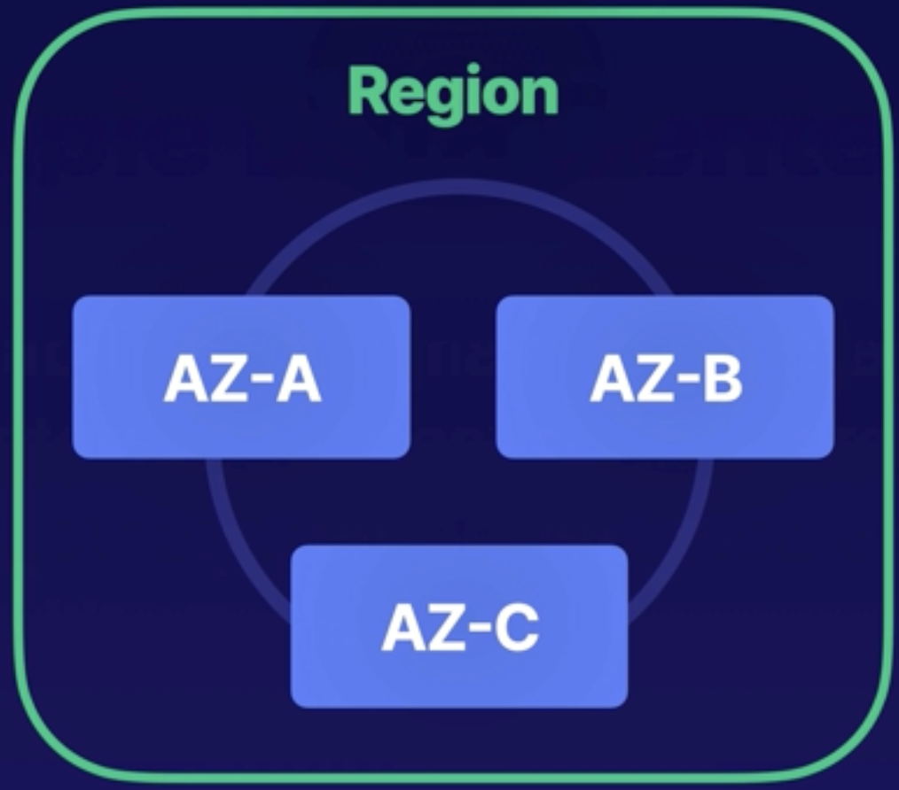
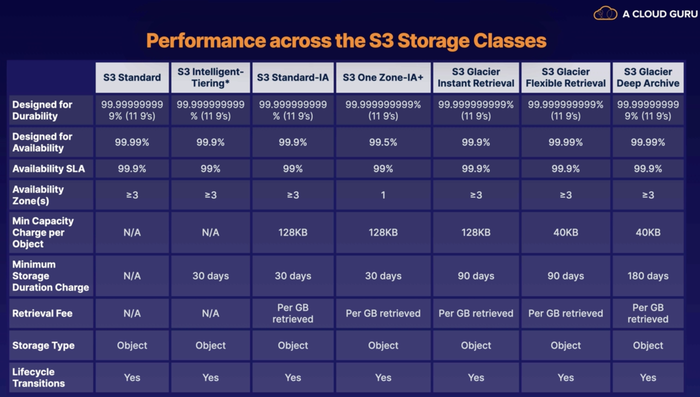
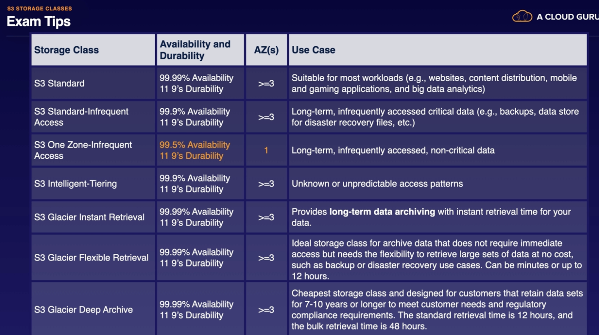
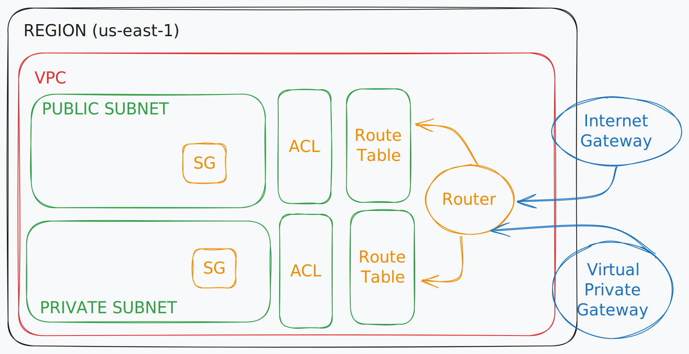
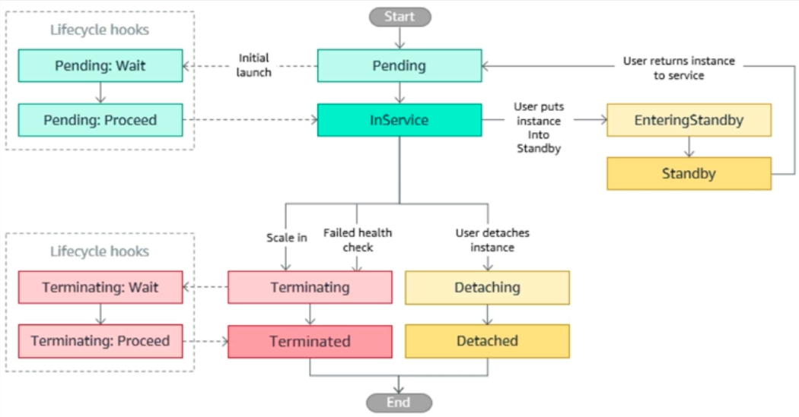

### SAA-C03

| Domains                                      |
| -------------------------------------------- |
| Design Resilient Architectures               |
| Design High-Performing Architectures         |
| Design Secure Applications and Architectures |
| Design Cost-Optimized Architectures          |

### Design Resilient Architectures

- Design multier Architectures
- Highly available and/or fault-tolerant
- Decoupling mechanisms
- Apporpriate Resilient

### Design High-Performing Architectures

- Elastic and scalable compute
- High-performing and scalabale storage
- High-performing networking solutions
- High-performin solutions

### Design Secure Applications and Architectures

- Secure Access
- Secure Aplication tiers
- Appropirate data security options

### Design Cost-Optimized Architectures

- Storage Solutions
- Computo and database services
- Network Architecture

### - AWS Fundamentals

- AWS Global infrastructure
  31 Regions (2 o more AZ)
  99 Availability Zone (Data Centers)

- Edge Locations
- The AWS Management Console
- A region is a physical location in the world that consists of two or more Availability Zone (AZs).
- An AZ is one or more dicrete data centers - each with redundant power, networking, and connectivity - housed is separete facilites.
- Edge locations are endpoints for AWS that are used for caching content. Typically, this consists of CloudFront, Amazon's CDN.
- The shared responsibility model

#### - Compute

- EC2
- Lambda
- Elastic Beanstalk

#### - Storage

- S3
- EBS
- EFS
- FSx
- Storage Gateway

#### - Databases

- RDS
- DynamoDB
- Redshift

#### - Networking

- VPCs
- Direct Connect
- Route 53
- API Gateway
- AWS Global Acelerator

#### Wel-Architected Framework

- Operation Excellence
- Performance Efficiency
- Security
- Reliability
- Cost Optimization
- Sustainability

### - IAM

- Create users and grant permissions to those users
- Create groups and roles
- Control access to AWS resources
- Enable multi-factor Authentication on the root account
- create an admin group for youy administrators, and assign the approprite permissions to this group
- Create user accounts for your administrators
- Add your users to the admingroup

### IAM Policy

- Foramte JSON
- Example of a Policy document

##### - IAM POLICY DOCUMENTS

          - Groups: Functions, Contains users
          - Users: A physical person
          - Roles: Internal usage within AWS

Effect \ Action \ Resource

##### The Principle of Least Privilege

- IAM is Universal

### - S3 (Simple Storage Service)

- Object Storage
- Scalable
- Simple

S3 Basics

- Unlimited Storage
- Objects up to 5TB in Size
- S3 Buckets

Working

- Universal Namespace
- S3 Urls
- Uploading Files
- Built for Availability (99.95% - 99.99%)
- Designed For Durability (99.99%) 9decimales mas

Securing

- Server-side Encryption
- Access Control Lists (ACLs)
- Bucket Policies

Key-value Store

- Key
- Value
- Version ID
- Metadata

_S3 is a safe place to store your files_.

Securing your data

1. Server-side Encryption
2. Access Control Lists (ACLs)
3. Bucket Policies

- Object ACLs: Work on an individual level
- Bucket Policy: Work on an entire bucket level

_Buckets are private by default_

_Static Content: Use S3 to host static content only_

_Automatic Scaling: S3 scales automatically with demand_

Advantages of versioning

- All versions
- Lifecycle Rules
- BackUp
- Supports MFA
- Cannot Be Disable

## S3 Standard

1. High Availability and Durability

   - (>=3 AZs)
   - 99.99% Availability
   - 99.99999999999 Durability (11 9's)

2. Designed for Frequent Access
3. Suitable for Most Workloads

## S3 Standard-Infrequent Access

- Rapid Access
- You Pay to Access the Data
- Use Cases

## S3 Zone-Infrequent Access

- Cost 20% less than regular S3 Standard-IA
- Great for long-lived, infrequently accessed non-critical data

## S3 Intelligent-Tiering

Glacier and Glacier Deep Archive

- Glacier Instant Retrival
- Glacier Flexible Retrival (minutos or up 12h)
- Glacier Deep Archive (48h)

---

## 

## 

Lifecycle Management

- S3 Standard (Keep for 30 Days) -> S3 IA (After 30 Days) -> Glacier (After 90 Days)

Tips use Lifecycle Management

- Automates moving objects between different storages tiers
- Can be used in conjunction with versioning
- Can be applied to current versions and previous version

S3 Object Lock

- Write onces, read many (WORM model)
- Can be on individual objects or applied across the bucket as a whole.
- Comes in two mode: Governance mode and compliance mode.

  - **Compliance** a portected object version can't be overwritten or deleted by any user, incliding the root user in your AWS accoount.
  - **Governance** Users can't overwrite or delete an object version or alter its lock sttting unless they have special permissions.

Encryption in Transit

- SSL/TLS
- HTTPS

Serve-side Encryption

- SSE-S3: AES 256-bit
- SSE-KMS: Services-managed Keys
- SSE-C: Customer-provided keys

- x-amz-server-side-encryption
- Two options
- PUT Request Header

Client-side Encryption

- Encrypt the files yourselfd before you upload them to S3

S3 optimizing

- S3 Prefixes
- KMS Request rates

S3 Replication

- Replicate Objects from one bucket to another.
- Not replicated automatically.
- Delete markers are not replicated by default.

### - EC2 (Elastic Compute Cloud)

- On-Demand
  - Flexible
  - Short-term
  - Testing the Water
- Reserved
  - Predictable Usage
  - Specific Capacity Requirements
  - Pay up front
  - Standard RIs
  - Convertible RIs
  - Scheduled RIs
- Spot
  - Save up to 72%
  - Commit to 1 or 3 Years
  - Super Flexible
- Dedicated
  - Compliance
  - Licensing
  - OnDemand
  - Reserved

How computer communicate

- Linux SSH Port 22
- Windows RDP Port 2289
- HTTP Web Browsing Port 80
- HTTPS Encrypted Web BrowsingPort (SSL) 443

Security Groups

- Virtual firewalls for you EC2
- By Default, everything is blocked.
  > To let Everything in: 0.0.0.0/0
- All inbound traffic is blocked by default.
- All outbound traffic is allowed.

User data vs Metadata

- User data is a sumply bootstrap scripts.
- Megadata is data about your EC2 instances.
- You can use bootstrap scripts (user data) to access metadata.

Networking with EC2

- ENI (Elastic Network interface)
- EN (Enhanced Networking) (Speeds 10 and 100 Gbps High throughput)
- EFA (Elestic fabric Adapter) (HPC)

Placement Groups

- Cluster
- Spread
- Partition

Outpost family

- Outpost Rack
- Outpost Server

### - EBS and EFS

- Elastic Block Storage
- Storage volumes you can attach to your EC2 Instances.
- Production Workloads
- Highly Available
- Scalabe

- General Purpose SSD (gp2)
  - Suitable for boot disks and general applications
  - Up to 16.000 IOPS per Volumen
  - Up to 99.9% Durability
- General Purpose SSD (gp3)
  - Suitable for high performances applications
  - Predictable 3,000 IOPS Baseline performance and 125 MiB/s Regardless of volumen size
  - Up to 99.9% Durability
- Provisioned IOPS SSD (io1)
  - Suitable for OLTP and latency-sensitive applications
  - 50 IOPS/GiB
  - Up to 64,000 IOPS per volumen
  - High performance and most expensive
  - Up to 99.9% Durability
- Provisioned IOPS SSD (io2)
  - Suitable for OLTP and latency-sensitive applications
  - 500 IOPS/GiB
  - Up to 64,000 IOPS per volumen
  - Up to 99.999% Durability
  - Latest generation porvisiones IOPS volume
- Throughput Optimized HDD (st1)
  - Suitable for Big Data, data warehouses and ETL
  - Max throughput is 500 MB/s per Volumen
  - Cannot be a boot volume
  - Up to 99.9% Durability
- Cold HDD (SC1)

  - Max throughput is 250 MB/s per Volumen
  - Less frequently accessed data
  - Cannot be a boot volume
  - Lowest cost
  - Up to 99.9% Durability

- **EFS (Amazon Elastic File System)**

  - Managed NFS (Network file system) that can be mounted on many EC2 instances.
  - EFS works with EC2 instances in multiple Avalaibility Zones.
  - Highly available and scalable: however, it is expensive.

  - Uses NFSv4 Protocol
  - Windows not supported at this time
  - Encryption at rest using KMS
  - Scales automatically

  - 1000s Concurrent connections
  - 10 Gbps Throughput
  - Petabytes Scaling

- **FSx**

  - Is built on windows Server

- **AWS BackUp**
  - Central Management
  - Automation
  - Improved Compleance

### - Databases

- RDS
- RDS is for OLTP Workloads

#### Data Base Engine

- SQL Server
- Oracle
- MySql
- Amazon Aurora
- Maria DB
- PostgresSQL

#### OLTP vs OLAP

- Online Transaction Processing (OLTP)
  - Trassaccional in real Time
- Online Analytical Processing (OLAP)

  - Complex Querys analize

- Multi-AZ
  - An Axact copy of your porduction database in another Available zone.
  - Used for diaster recovery
  - In the event of a failure, RDS will automatically fail over to the Stanby instance.
- Read Replica
  - A read-only copy of your promary database in the same AZ
  - Used to increase or scale read performance
  - Great fot read-heavy workloads and takes the load off primary database.

#### Amazon Aurora

- Database relacional
- 2 Copies of your data are contained in each AZ, with min 3 AZ. 6 Copies of your data.
- You can share Aurora snapshots with Other AWS Account
- 3 Types of repplicas available: Aurora, MySql, PostgresSQL

#### DynamoDB

- NoSQL database
- Sopports document and key-value data models.
- Eventually consistent reads (Default)
- DynamoDB Point-in-time Recovery(PITR)
  - Restore to any point in the last 35 Days
  - No enable by befault

#### Atomic - Consistent - Isolated - Durable

#### DocumentDB

- NoSql Database

#### Amazon Keysapces

- Amazon's Apache cassadra database service.
- Keysapces is serverless.

#### Amazon Neptune

- Graph Database

#### Quantum Ledger Database (QLDB)

- Ledger database: immutable, trasparent and has cryptographically

#### Analyzing Time-series Data (Amazon Timestream )

- IoT
- Analytics
- DevOps Applications

### - VPC Networking

- Virtual data center in the cloud
- Isolated part AWS cloud
- Fully cumtomizable network

- NAT gataways

  - Network Address traslation
  - Redundant inside the AZ
  - Start at 5Gbps and scale currently to 45 Gbps
  - No need to patch
  - Not associated with security groups
  - Automatically assigned a public IP Address

- Security Groups

  - Virtual Firewalls for an EC2 Instance.
  - By default, everything is bloked.
  - SG are statefull

- Network ACLs

  - The first line of defense
  - A network access control list
  - By default it allows all traffic.
  - Block Ip address using ACLs Not SG.
  - ACLs are stateless

- VPC Endpoints

  - Option 1: Interfaces Endpoint
  - Option 2: Gataway Endpoint (S3 and DynamoDB)

- VPC Peering

  - Allows yoy to connet 1 VPC with another
  - Transitive peering is not supported
  - No overlapping CIDR address ranges

- PivateLink
  - Doesn't require VPC peering, no route table, Nat etc
  - Requires a Network Load Balance on the service VPC and an ENI on customer VPC

### - Route 53

- DNS?

  - Computer use DNS to convert domain names into IP Addresses.

  - IPv4 - 32-bit
  - IPv6 - 128 Bits

- Record
- TTL
- CNAME (Canonical name)

- Route 53 (7 Routing Policies Avalable)

  - Simple Routing
  - Weighted Routing
  - Latancy-Based Routing
  - Failover Routing
  - Geolocation Routing
  - Geoproximity Routing (Traffic Flow Only)
  - Multivalue Answer Routing

- Elastic Load Balancing
  - Application Load Balancer
  - Network Load Balancer
  - Gataway Load Balancer
  - Classic Load Balancer

### - Elastic Load Balancing

- Application Load Balancer

  - Balancing HTTP and HTTPS Trafic
  - Operate at layer 7
  - Inteligent Load Balancer

  - Listeners
  - Rules
  - Target Groups

  - Only support HHTP and HTTPS

- Network Load Balancer

  - Operate at layer 4
  - Performance Load Balancer

  - Listeners
  - Target Groups

- Gataway Load Balancer

  - Operate at layer 3
  - For inline Virtual Appliance Load Balancig

- Classic Load Balancer

  - Operate at layer 4/7
  - Classic/Test/Dev Load Balancer
  - Legacy Load Balancer

- Health Checks
  - Use route traffic to instances or traget that are healthy

### - Monitoring

- CloudWatch

  - System Metrics
  - Application Metrics
  - Alarms

  - Log Event
  - Log Stream
  - Log Group

  - Filter Patterens
  - CloudWatch Logs Insights
  - Alarms

- Managed Grafana

  - Container Metric Visualizations
  - Internet of Things
  - Troubleshooting

- Managed Service for Pormnetheus
  - Automatic Scaling
  - Open-Source Pormetheus
  - Desingned for High Availability
  - Choose your Kubernetes
  - PromQl
  - Data Retention

### - High availability and scaling

- Vertical
- Horizontal

- The 3 W's of Scaling

  - What do we sacale?
  - Where do we scale?
  - When do we scale?

- Auto Sacaling Step

  - Define Template
  - Networking amd Purchasing
  - ELB Configuration
  - Set Scaling Policies
  - Notifications

- Auto Scaling Retrictions

  - Minumun
  - Maximun
  - Desired

- Lifecycle Hooks

1. EC2 instance gets launched by EC2 Auto Scaling group

2. WAIT state is entered via the Lifecycle Hooks capability

3. While in the WAIT state, the instance runs a custom script via EC2 user data to install a proprietary application

4. Script install and configure application

5. Once the application is validated to be working correctly, the instance sends a complete-lifecycle-action command

- Scaling Types
  - Reactive Scaling
  - Scheduled Scaling
  - Predictive Scaling
- Scale Out Aggressively
- Scalle In Conservatively

- 4 Ways to Scale

  - Vertical Scaling
  - Scaling Storage
  - Read Replicas
  - Aurora Serverless

- Scaling Databases

  - RDS has the most database scaling options
  - Horizontal scaling is usully preferred over vertical
  - Read replicas are your friends
  - DynanoDB scaling comes down to access patterns

- Disaster Recovery Strategies

  - Recovery Point Objetive (RPO)
  - Recovery Time Objective (RTO)

  - Backup and Restore
  - Pilot Light
  - Warm Standby
  - Active/Active Failover

  - Simple Queue Services (SQS)
  - Simple Notofication Service (SNS)
  - API Gateway

  - SQS

    - Poll-based
    - Delivery Deley. Default 0
    - Message Size. 256 KB
    - Encryption.
    - Message retention. Default 4Days
    - Long vs Short
    - Queue Depth

  - Dead-Letter Queues
    - Cannot be porcessed successfully
    - Works with SQS and SNS

### - Decoupling workflows

USER &rarr; FRONT &rarr; BACK

- Simple Queue Service (SQS)
- Simple Notofication Service (SNS)
- API Gataway

- Always loosely couple
- Never Tighly couple
- Ineternal and External
- One Size

- Simple Queue Service (SQS)

  - Poll-based Messaging?

- SQS Setting

  - Delivery delay: Default 0; can be set up to 15 minutes.
  - Message Size: Messages can be up to 256 KB of text in any format.
  - Encrypt: Message are encrypted in trasit by default.
  - Message Retention: Default is 4 days; can be set between 1 minutes and 14 days.
  - Long vs Short: Long polling isn't the default, but it should be.
  - Queue Depth: This can be trigger for autoscaling.

- Sidelining Message with Dead-Letter Queues

  - Dead-Letter Queue (DLQ) are targets for messages that cannot be processed successfully.
  - Works with SQS and SNS!
  - Useful for debugging applications and messages system
  - Ability to isolate unconsumed messages to Troubleshoot
  - Redrive capability allows you to move the message back into the source Queue
  - These are technically just other SQS Queue
  - DLQs Used with FIFO SQS Queue must ALSO be FIFO Queues.

- Standard vs FIFO

| Standard                                 | FIFO                        |
| ---------------------------------------- | --------------------------- |
| Best-effort ordering                     | Guarenteed ordering         |
| Duplicate messages                       | No message duplication      |
| Nearly unlimited transactions per second | 300 transactions per second |

- Simple Notofication Service (SNS)

  - Is a Push-based messaging service.
  - It Proactively delivers messages to teh endpoints that are subscribed to it
  - This can be used to alert a system or a person
  - One message to many receivers

- SNS Setting

  - Subscribers: Kinesis data firehose, SQS Lambda, Email, HTTP(s), SMS, And platafrom apoplication endpoint.
  - Message Size: Messages can be up to 256KB to text in any format.
  - DLQ Support: Message that fail to be delivered can be stored in an SQS DLQ.
  - FIFO or Standard: FIFO Only supports SQS FIFO queues as a Subscriber
  - Encryption: Message are encryptedin trasitbe default. and ca add at-rest via AWS KMS
  - Access Policies: A resource policy cab be added to a topic. similar to S3. Useful for across-accoount access.

- API Gateway

  - Is a fully managed services that allows you to easily publish create, mantein, monitor, and secure your API.

- AWS Batch

  - Run batch computing workloads
  - Makes Thing Simpler
  - Automatically Provision and Scale
  - No Install Requiered!

  - Jobs
  - Job Definitions
  - Job Queues
  - Compute Environment

- Fargate vs EC2

| Fargate                                 | EC2                                       |
| --------------------------------------- | ----------------------------------------- |
| Recommneded Approach for most Workloads | Need more control over instance selection |
| Require fast start times (<30Seg)       | Require GPUs                              |
| Require 16vCPU or less                  | Require Elastic Fabric Adapter            |
| Require no GPUs                         | Require Cistim AMIs                       |
| Require 120 GiB of Memory or less       | High levels of concurrency                |
|                                         | Require access to Linux Parameters        |

### Amazon MQ Overview

- Message broker services allowing easier migrate of existing applications to the AWS Cloud
- Leverages multiples programming language, operating systems, and messaging protocols
- Currently support both Apache ActiveMQ or RabbitMQ engine Types
- Allows you to easily leverage existeng apps without managing and maintaing your own system

### Step Functions Overview

- Serverless orchestration services
- Graphical console
- Main componentes are state machines and task
- State Machine
- Task. Specific states within a worflow
- States Every single step within a worflow is consideraed a state

| Standard                                                                | Express                                                            |
| ----------------------------------------------------------------------- | ------------------------------------------------------------------ |
| Have an exactly-one execution                                           | At-least-once workflow execution                                   |
| Can run for up to one year                                              | Can run for up five minutes                                        |
| Useful for long-runnig workflows that need to have an auditable history | Useful for high-event-rate workloads                               |
| Rates up to 2.000 executions per second                                 | Example use is IoT data streaming and ingesrion                    |
| Pricing based per state transition                                      | Pricing based on number of execution durations and memory consumed |

### - Different States

- Pass
- Task
- Choice
- Wait
- Succeed
- Fail
- Parallel
- Map

### AppFlow Overview

- Fully managed integration service for exchaging data between SaaS apps and AWS Services
- Pulls data records from third-party SaaS vendors and stores them in Amazon S3
- Bi-directional data transfers with limited combinations

### - Big data

### The 3 Vx of Big Data

- Volumen
- Variety
- Velocity

### Amazon Redshift

- Is a fully managed, petabyte-scale data warehouse services in the cloud
- it's very large relational database traditionally used in big data applications
- Recived its name due to desire to have people leave Oracle databases and levarege this AWS sevices instead

- Size. Can hold up 16 PB of Data
- Relational
- Based on PostgresSQL
- Usage
- High Performance
- Columnar

### Elactic MapReduce (EMR)

- ETL?

  - Extract
  - Trasform
  - Load

- EMR?

An AWS Service to help with ETL Processing.

Hadoop Distributed Files System (HDFS)
EMR File System (EMRFS)
Local file System

### Purchasing Options and Cluster Types

- On-Demand
- Reserved
- Spot
- Long-Running or Temporary

### Kinesis

- Allows you ingest, process, and analyze real-time Streaming data. You can think of it as a huge data highway connected to your AWS accoount.

### 2 Versions

- Data Streams
- Data FireHose

### Athena?

Is an interactive query services that makes it easy to analyze data in S3 using SQL.
This Allows you to directly query data in your S3 Bucket without loading it into a database

### Glue?

Is a serverless data integration servioces that makes it easy to discover, prepare, and combine data.
It allows you to perform ETL workloads without managing underlying servers.

### Amazon QuckSight

Fully managed, serverless business intellignce (BI) data Visualizations service.
it allows you to easily create dashboards and shere them with specific users and groups.

### AWS Data Pipeline

Is a managed Extract, Trasform, Load (ETL) service for automating movement and transition of your data.

- Data Driven
- Parameters
- Highly Available
- Handling failures
- AWS Storage Services
- AWS Compute

#### Amazon MSK

- Fully Managed services for runnig data streaming Aplication that leverage Apache Kafka.
- Providers control plane operations. Creates, Updates, and deletes cluster as required.
- Data Plane, Leverage Kafka data-plane operationes for proceducing and cosuming streming data.
- Existing Application, Open Source Version of apache Kafka allow support for existing apps tools, and plugins.

### Important componentes

- Broker Nodes
- Zookeper Nodes
- Cluster Operations
- Producers, Consumers and Topics

#### Amazon OpenSearch Services

Is a managed services allowing you to run search and analiytics engines for varios use case.
Is is the successor to Amazon ElasticSearch Service.

- Quick Analysis
- Scalable
- Security
- Stability
- Flexible
- Integrations

### - Security

### - AI amd ML

### - Media

### - Serverless architecture

### - Automation

### - Caching

### - Governance

### - Migration

### - Well-Architected

- Operational Excellence
  - Perform Operations as code
    - Think of your workload as a piece of sottware
    - By turning operations into scripts & automating them
  - Make frequent, small, reversible changes
    - Make changes in small steps that can be undone
    - This helps you deal with issues quickly
  - Refine Operations Procedures frequently
    - All about "Constant Improvement"
    - As your workloads evolves, Proceduresshould also evolve
    - Be on the lookout for ways to refine & streamline operations
  - Anticipate failure
    - Identify possible failures before they accur
    - By regularly testing these scenarios
  - Learn from Operational failures
    - Every operational event / failure is a learning opportunity
    - Use these lessons to build stronger, more resilient systems
    - Sharing this knowledge can lead to significant improvements
- Security
  - Focuses on portecting data, system & assets
  - Confidentiality of data
  - Identity & Access management
  - Controls to detect security threats
- Reliability
  - Automatically Recover from failure
    - Monitor important metrics closely
    - Use automation to fix issues as soon as they aoccur
    - Your system bounces back when something goes wrong
  - Test Recovery Procedures
    - Actively test how our systems handle failures
    - Use automation to simulate different failure scenarios
  - Horizontlly Scale to increase Aggregate workload Availability
    - The goal is to spread workload across multiple small resources
    - If one part fails, it won't shut down everything
  - Stop Guessing capacity
    - Manitor how much our systems ate being used
    - Adjust our resources accordingly
    - The goal is to have the exact resources we need
  - Manage change Throgh automation
    - Automate changes to our infrastructure
    - This method ensures consistent, easily trackable and smooth running results
- Performance Efficiency
  - Using computing resources efficiently
  - Maintaining the efficiency as changes occur
- Cost Optimization
  - Avoiding unnecessary cost
  - Using the right type of resources
  - Meking cost-effective decisions

---

- Implement cloud financial mangement
- Adopt consumption model
- Measure overall efficiency
- Stop spending money on undifferentiated lifting
- Analyze and attribute expenditure

### Practical Projects to learn AWS

---

- [ ] Static Website Hosting on S3 (Route53/CloudFront/S3)
- [ ] Create Policy own reset password (IAM)
- [ ] CRUD APP Using ECS + LoadBalancing (Route53/LB/ECS/ECR/VPC/RDS-MySql)
- [ ] API Hosting (Route53/Api Gateway/Lambda)
- [ ] Data Processing Pipeline Twitter (Kinesis/S3/Lambda/ElasticSearch/Kibana)
- [ ] Distributed Serverless Workflow for Stock Proce Movements (Yahoo!/CloudWatch/SQS/Lambda/DynamoDB/Lambda/SES)
- [ ] Down Size Instances EC2
- [ ] Manage Lifecycle BackUp

- Full Wep App (Elastick Bean Storage)

- Networking layer in Terrafrom

  - VPC / Subnet / Routing
  - Build a VPC
  - Create Availability zone
  - Define Subnets
  - Update Route Tables
  - Deploy EC2

- Front/API Resumen Online
- Dockerizar Web App
- Build CI/CD Actions

- Daily Task Scheduler Application using PartyRock (NO)
- Image Labels Generator Using Amazon Rekognition
- Develop a text narrator using Amazon Polly
- Deploy a bucket list tracker application on AWS Amplify

-

### Revision for success

- Focus on areas you feel the least comfortable
- Practice Exam
- Take a Break

- Search for the answer yourself
- Try to build it in an actual AWS Account
- Checks the AWS FAQs
- Post in our forums
- Search again!

### 5 Tips AWS Exam

- Spot the distractors.
- Watch for like "More", "least", etc.
- The word soup is never right if it makes you laugh, it's wrong.
- Word association is your friend.
- Read Every answer least once.

### Master the AWS Solutions Architect Associate Exam in 2024

---

### Resources

---

- [New Here?](https://www.youtube.com/playlist?list=PL9nWRykSBSFigYYU-PV7u0fn5tn_ee-iu)

- [A Cloud Guru | SAA-C03](https://learn.acloud.guru/course/certified-solutions-architect-associate)

- [AWS SAA-C03 PRACTICE EXAM QUESTIONS - Master the AWS Solutions Architect Associate Exam in 2024!](https://www.youtube.com/watch?v=FhRQq7obZ64)
