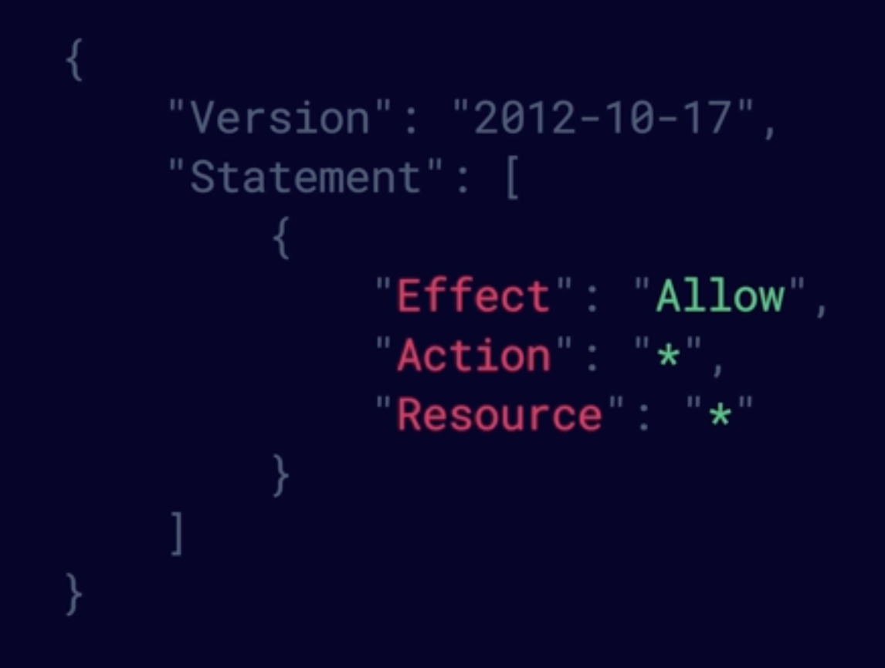

## SAA-C03

|Domains | 
|----    |
| Design Resilient Architectures |	
| Design High-Performing Architectures | 
| Design Secure Applications and Architectures | 
| Design  Cost-Optimized Architectures |

### Design Resilient Architectures
- Design multier Architectures
- Highly available and/or fault-tolerant
- Decoupling mechanisms
- Apporpriate Resilient

### Design High-Performing Architectures
- Elastic and scalable compute
- High-performing and scalabale storage
- High-performing networking solutions
- High-performin solutions

### Design Secure Applications and Architectures
- Secure Access
- Secure Aplication tiers
- Appropirate data security options

### Design  Cost-Optimized Architectures
- Storage Solutions
- Computo and database services
- Network Architecture

### - AWS Fundamentals 
 - AWS Global infrastructure
   31 Regions (2 o more AZ)
   99 Availability Zone (Data Centers)

 - Edge Locations
 - The AWS Management Console
 - A region is a physical location in the world that consists of two or more Availability Zone (AZs). 
 - An AZ is one or more dicrete data centers - each with redundant power, networking, and connectivity - housed is separete facilites. 
 - Edge locations are endpoints for AWS that are used for caching content. Typically, this consists of CloudFront, Amazon's CDN.
 - The shared responsibility model

#### - Compute
- EC2
- Lambda
- Elastic Beanstalk 
#### - Storage
- S3
- EBS
- EFS
- FSx
- Storage Gateway
#### - Databases
- RDS
- DynamoDB
- Redshift
#### - Networking
- VPCs
- Direct Connect
- Route 53
- API Gateway
- AWS Global Acelerator 

#### Wel-Architected Framework
- Operation Excellence
- Performance Efficiency
- Security
- Reliability
- Cost Optimization
- Sustainability

### - IAM 
- Create users and grant permissions to those users 
- Create groups and roles 
- Control access to AWS resources
- Enable multi-factor Authentication on the root account 
- create an admin group for youy administrators, and assign the approprite permissions to this group
-  Create user accounts for your administrators 
- Add your users to the admingroup

### IAM Policy 
- Foramte JSON 
- Example of a Policy document 

##### - IAM POLICY DOCUMENTS 
          - Groups: Functions, Contains users
          - Users: A physical person
          - Roles: Internal usage within AWS    
Effect \ Action \ Resource

##### The Principle of Least Privilege 

- IAM is Universal 

### - S3 

### - EC2 
### - EBS and EFS 
### - Databases 
### - VPC Networking 
### - Route 53 
### - Elastic Load Balancing 
### - Security 
### - AI amd ML 
### - Media 
### - Monitoring 
### - High availability and scaling 
### - Decoupling workflows 
### - Big data
### - Serverless architecture 
### - Automation 
### - Caching 
### - Governance
### - Migration

### Practical Projects to learn AWS
____

  [] Create Policy own reset password 
  [] Down Size Instances EC2 

### Resources 
____

[A Cloud Guru](https://learn.acloud.guru/course/certified-solutions-architect-associate)

