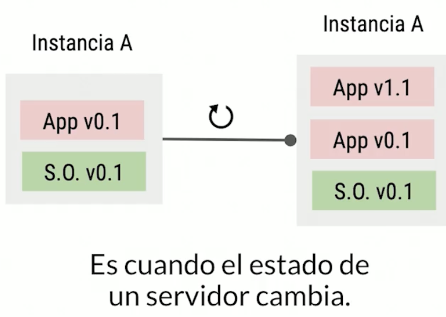
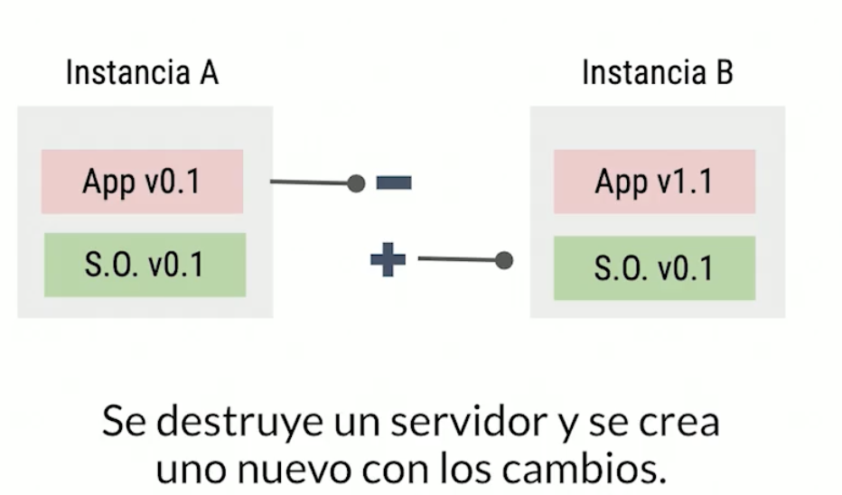

### Terraform || [Official Site](https://www.terraform.io/)

- Infraestructura mutable
  

- Infraestructura inmutable
  

- Lenguaje Declarativo (Que Hacer)
- Procrdural o Imperativo (Como Hacerlo)

### Packer

- **Variables**: tal como su nombre lo indica, aquí definimos las variables que vamos a utilizar.
  builders: indicamos de donde vamos a construir nuestra imagen base.

- **Provisioners**: acá personalizamos nuestra imagen, añadir paquetes, crear directorios, definir el estado de la infraestructura, etc.

- **Post-processors**: podemos tener archivos de salida y ejecutar comandos después de haber creado la infraestructura, todo corre de manera local.
